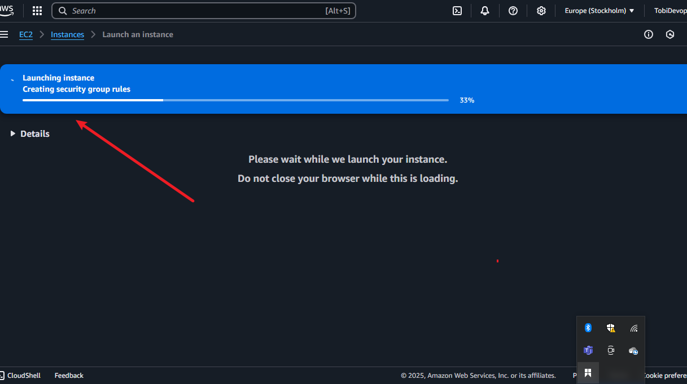
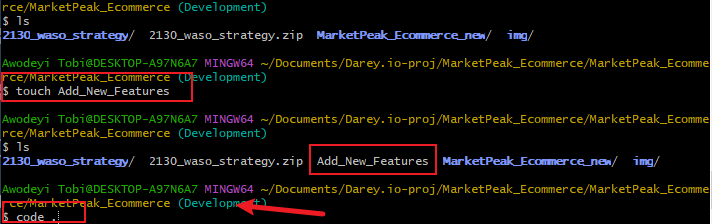
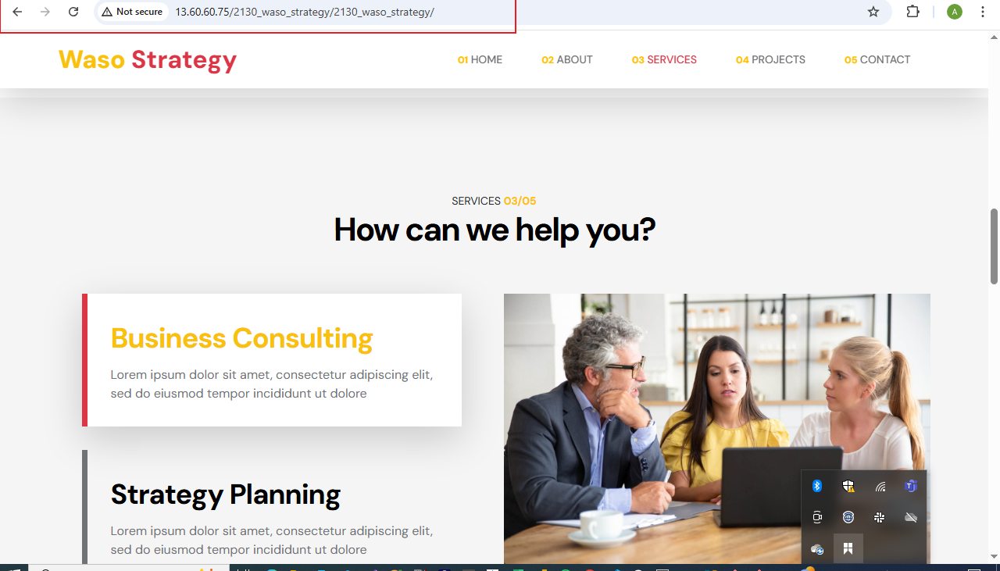

# MarketPeak Ecommerce

An Ecommerce platform for managing Products, orders, and Customers.

## Features

- Product Management
- Order Processing
- Customer Accounts

# Capstone Project: E-Commerce Platform Deployment with Git, Linux, and AWS

**Abstract**

This capstone project focuses on deploying a static e-commerce website using Git, Linux, and AWS. It demonstrates proficiency in version control, cloud computing, and web server configuration. The project follows a structured approach, including repository setup, website deployment, and continuous integration for updates. The final implementation ensures a scalable and accessible web presence hosted on AWS.

**Description**

This project demonstrates the skills and knowledge I have acquired in setting up and deploying a static website using Git, Linux, and AWS. It showcases my ability to implement version control through Git, manage a structured development workflow, and deploy applications in a cloud environment. The project involves creating and managing branches, staging, committing, and pushing changes to a remote repository, as well as configuring and hosting the website on an AWS EC2 instance. Detailed snapshots of the commands executed and tasks performed are included for documentation and transparency. This capstone project reinforces my expertise in Git operations, Linux server management, and cloud deployment, key skills essential for modern DevOps practices.

# Objective

- Implement Version control using GIT.

- Host a Static e-commerce website using AWS Ec2.

- Automate Deployments using Git workflow.

- Secure and optimize the server configuration for better performance.

# Tools and Technologies Used

- Version Control: Git, GitHub

- Cloud Services: AWS EC2.

- Operating System: Linux (Ubuntu/CentOS)

- Web Server: Apache

- Development Tools: CLI, SSH

- Programming Languages: HTML, CSS, JavaScript (if applicable)

## Setup

Instructions on how to set up and run the proj Step by Step.

1. VERSION GIT CONTROL
 
    Creating Local Repository
    

    Downloading Website Template

    

    Stage and Commit the Website Template to Git

    set Global User Name and e-mail.

    

    git add to stage

    

    git commit -m to commit files

    

    status

    

    Git push to push to the new Repository

    

    New Repository

    
    

2. AWS DEPLOYMENT

    Setting Up AWS Ec2 Instance

    loggin On to AWS console

    

    Launch a New Ec2 Instance

    

    

    Configuration Using Ubuntu AMIs

    

    

    

    

    CONNECTING to Ec2 Instance Using SSH

    

    CONNECTED

    

    

    Key-Gen for Connecting Ec2 Instance to Github

    

    

    Copying Github SSH Adress

    

    Entering New SSH Key-Gen

    

   

     ## Git Cloning Using SSH

    clone Git Repository on AWS Serve

    

    ## INSTALLING WEB SERVER ON Ec2 INSTANCE

    Updating All Packages

    

    Install and start apache server

    

    ## Configure Apache Server
    
    
    Prepare Server by Clearing Default HTTPD Web Directory and Replace with Market Peak E-Commerce Files

    

    Reload Apache Server

    

    Updating Apache Url to 2013_waso_strategy

    

    ## Access the Website through Web Browser

    Copy Public IP and Open in a Browser

    

    ## Continuous Integration and Deployment

    Creating a Development Branch

    

    

    Making and Deploying Changes

    

    

    

    Git Checkout origin main

    

    Creating a pull Request

    

    

    

    UPDATING ORIGIN 

    

    ## Testing Changes

    Website After Changes

    

    ## Results & Testing

   - The website is successfully hosted on AWS.

   - The Git repository enables version control and easy updates.

   - Continuous integration ensures smooth deployment.

   - The website is accessible via the EC2 instance’s public IP.

    
    ## Challenges & Solutions

    ### Challenges Faced:

   - Trying too effect changes from the Production server side.

   - Knowing the policies for my server to be able to access via web browser.

   - Git merge conflicts during updates.

    ## Solutions Implemented:

   - I used the changes that were git pulled from my remote repository to update apache url location(\var\www\html).

   - Made sure my server allowed web traffic on port 80.

   - Resolved conflicts by managing Git branches efficiently.

    ## Conclusion

    The Market Peak E-Commerce Website project successfully demonstrates cloud deployment, Git-based version control, and continuous integration. Future improvements included.

